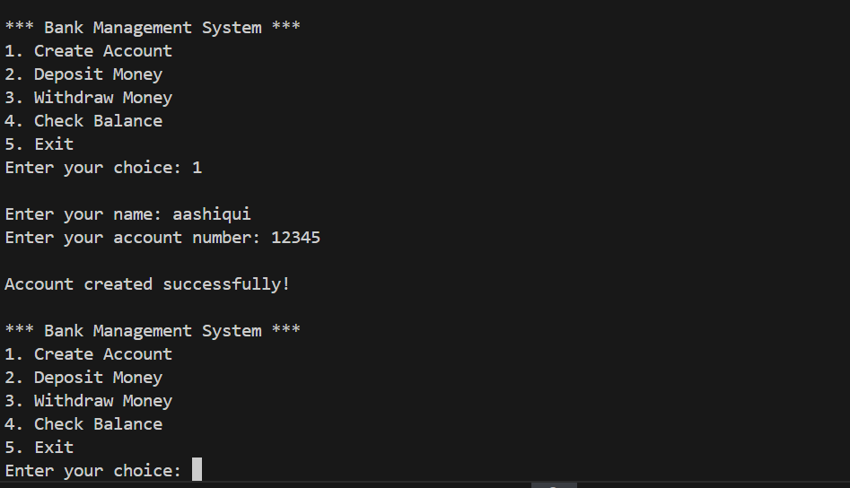

## 1. Number Guessing Game
  

## 2. Simple Calculator
  

## 3. Digital Clock
 

 
  
## 4. Progress Bar
  

## 5. User Management
  
  
## 6. Bank Management System
  
  
## 7. SUDOKU Solver
  

## 8. Tic-Tac-Toe
  

  

## 9. Snake Game
   
  
## 10. Kaun Banega Corerepati
  
  
  